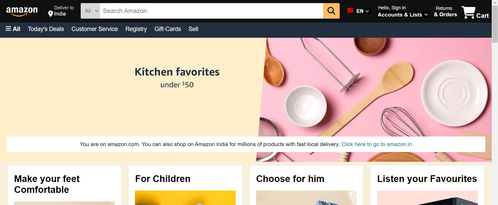
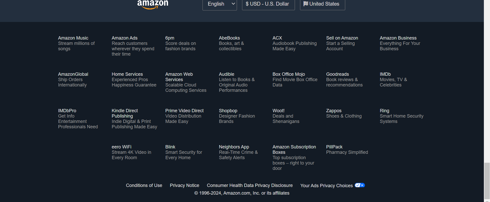

# Amazon Clone
This is a front-end clone of the Amazon website, created using HTML and CSS. This project is intended to replicate the look and feel of Amazon's homepage, providing a similar user interface without the back-end functionality.

## Features
- Navigation bar with search functionality (UI only)
- Product listings with images, and titles.
- Footer with useful links and information

## Screenshots

## Getting Started
### Prerequisites
- A web browser (Chrome, Firefox, Safari, etc.)
